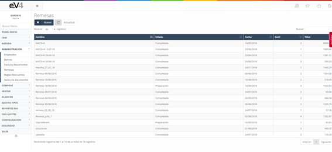
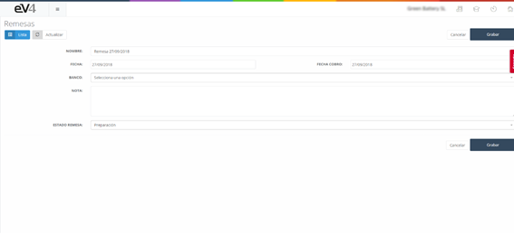
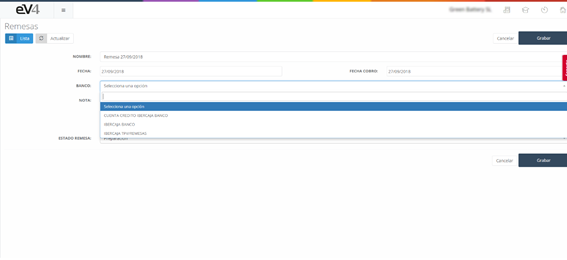
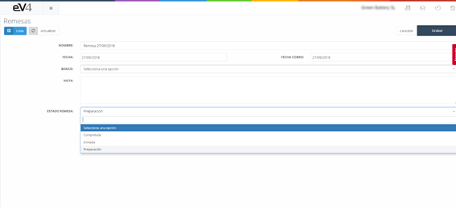
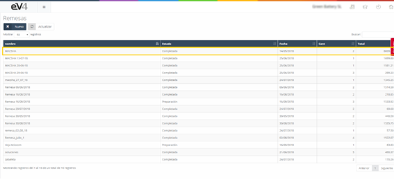
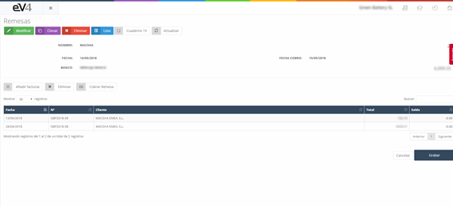
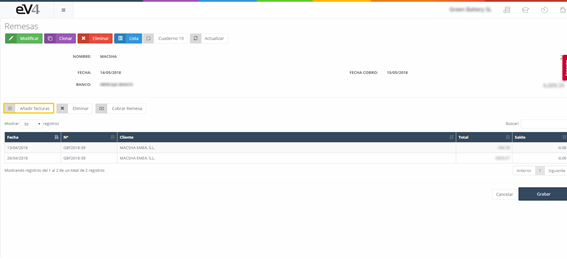
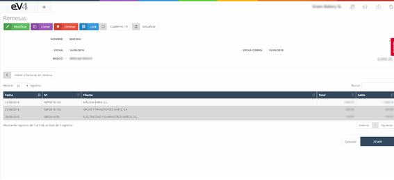
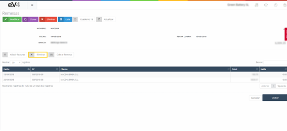
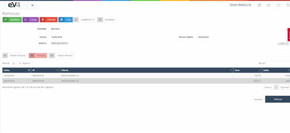

#### Remesas

Una remesa es básicamente un documento para poder liquidar una compraventa de cualquier tipo de mercancía. Es un documento financiero por el que damos la orden a nuestro banco para que proceda a gestionar el cobro o pago de esa compraventa que hemos realizado. Es decir, es un archivo por el que se entregan uno o varios conjuntos de recibos a nuestra entidad bancaria, y así, ésta, gestiona el cobro de todos los documentos que le estamos pidiendo.

Una vez tenemos el documento de remesas, debemos enviarlo a nuestro banco para que proceda al cobro o pago de ellas.

##### Por ejemplo:

Imaginemos que somos una empresa y queremos pagar a nuestros proveedores, a 10 de ellos para saldar deudas. Crearemos una remesa con todos los campos que explicamos más adelante – donde se detallan las cantidades, el proveedor, la fecha, etc. – la enviaremos al banco posteriormente y él se encargará de pagarles a todos. Sin tener que hacer nosotros cada una de las transferencias. Es la orden de pago. Y así, ya tendremos los pagos hechos de esas facturas que queremos liquidar.

##### ¿Cómo funcionan las remesas?

Cuando hablamos de remesas de ingreso, es decir, cobros, estamos dando una orden de dichos cobros a nuestro banco para que proceda a ejecutarlos. En ese momento, el saldo de nuestro banco sube y se cancela el saldo de los clientes que acabas de cobrar.

Cuando hablamos de remesas de gastos, es decir, pagos, estamos dando una orden a nuestro banco conforme pagaremos dichos cobros. En ese momento, el saldo de nuestro banco baja, es decir, baja la tesorería y se cancelan los saldos pendientes de proveedores.

Pasado este momento, ya hemos gestionado nuestros cobros y pagos.

Cuando entramos en la sección “REMESAS” vemos la siguiente pantalla:

Donde tenemos una lista con las remesas que se han creado en el sistema.

Para crear una nueva Remesa pulsamos el botón “NUEVO”.

Donde tenemos que rellenar los siguientes campos:

- **NOMBRE**: Nombre con el que identificaremos a la remesa.
- **FECHA**: Fecha de creación de la remesa.
- **FECHA DE COBRO**: Fecha de cobro de la remesa.
- **BANCO**: Cuenta corriente a la que hay que cargar o ingresar el importe de la remesa. Si pulsamos sobre este campo se nos abre un desplegable desde el que podremos elegir una de las cuentas ya configuradas en la aplicación.

- **NOTA**: En este campo podemos añadir una pequeña descripción a título informativo.
- **ESTADO REMESA**: Si pulsamos sobre este campo se nos abre un desplegable donde podemos seleccionar uno de los siguientes estados: Completada, Enviada y Preparación.

Cuando terminemos de rellenar todos los campos, pulsamos el botón “GRABAR” para que la remesa se almacene en el sistema.

Una vez que estemos en la vista general de la sección “REMESAS”, para consultar una remesa solo tenemos que pulsar sobre ella.

Y veremos las facturas o recibos que componen la remesa.

Ahora veremos con detenimiento la función de los siguientes botones:

- **Añadir Facturas**: Este botón nos permite añadir facturas a la remesa.

Al pulsar este botón, se nos abrirá otra ventana, con la lista de facturas disponibles para añadir a la remesa. Consultar al final de la sección la configuración de facturas a mostrar.

Para seleccionar una factura, pulsamos sobre ella y quedará marcada en gris. Repetimos este proceso con todas las facturas que queramos añadir. Para finalizar, pulsamos el botón **“Añadir”** y las facturas seleccionadas serán incluidas en la remesa.

Si pulsamos el botón **“Volver a facturas en remesa”** volveremos a la pantalla anterior.

- **Eliminar**: Este botón nos permite eliminar facturas de la remesa.

Al pulsar este botón, veremos cómo cambia de color y se vuelve rojo. Seleccionamos las facturas que queremos eliminar de la remesa y estas quedarán marcadas en color gris. Para que sean eliminadas de la remesa, pulsamos el botón **“Eliminar”**. La remesa será modificada y se almacenará en el sistema.

