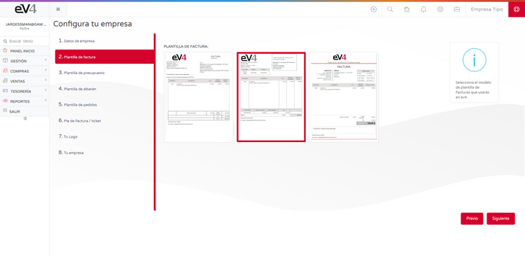
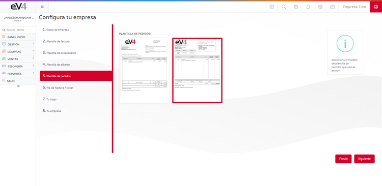
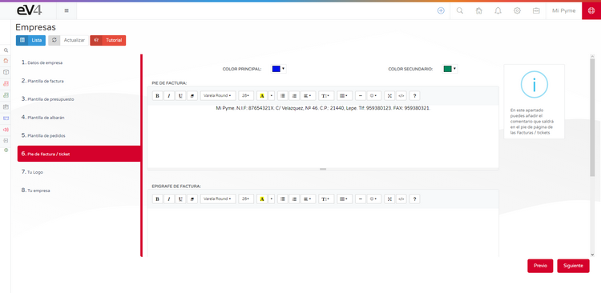
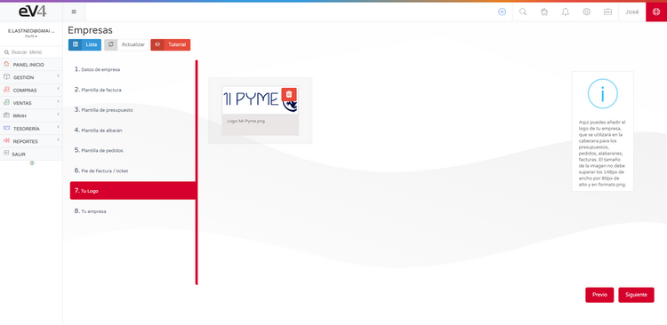
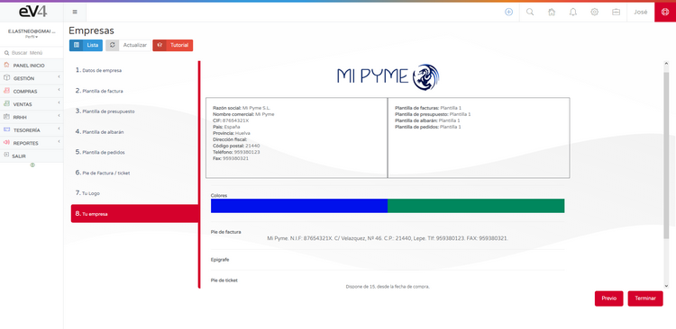

#### 1. DATOS DE LA EMPRESA

- **RAZÓN SOCIAL**: Razón social de la empresa.
- **NOMBRE COMERCIAL**: Nombre de la empresa.
- **NIF**: Número de Identificación Fiscal de la empresa.
- **PAÍS**: País en el que se encuentra registrada la empresa.
- **PROVINCIA**: Provincia en la que se encuentra registrada la empresa.
- **DIRECCIÓN FISCAL**: Dirección en la que se encuentra registrada la empresa.
- **CÓDIGO POSTAL**: Código Postal de la localidad donde se encuentra registrada la empresa.
- **TELÉFONO**: Teléfono de la empresa.
- **FAX**: Fax de la empresa.
- **RECARGO DE EQUIVALENCIA**: SI/NO. Si activa esta opción, se aplicará el recargo de equivalencia correspondiente en todas las facturas de venta.

#### 2. PLANTILLA DE FACTURA

En esta pantalla podemos seleccionar la plantilla que utilizará el sistema para las facturas, solamente tendremos que pulsar sobre la plantilla elegida y a continuación pulsar el botón **SIGUIENTE**.

#### 3. PLANTILLA DE PRESUPUESTO

En esta pantalla podemos seleccionar la plantilla que utilizará el sistema para los presupuestos, solamente tendremos que pulsar sobre la plantilla elegida y a continuación pulsar el botón **SIGUIENTE**.

#### 4. PLANTILLA DE ALBARÁN

En esta pantalla podemos seleccionar la plantilla que utilizará el sistema para los albaranes, solamente tendremos que pulsar sobre la plantilla elegida y a continuación pulsar el botón **SIGUIENTE**.

#### 5. PLANTILLA DE PEDIDOS

En esta pantalla podemos seleccionar la plantilla que utilizará el sistema para los pedidos, solamente tendremos que pulsar sobre la plantilla elegida y a continuación pulsar el botón **SIGUIENTE**.

#### 6. PÍE DE FACTURA/TICKET

En esta pantalla podemos personalizar el texto que aparecerá en el pie de las facturas, el pie de los tickets y el epígrafe de las facturas. Cuando terminemos solamente tendremos que pulsar el botón **SIGUIENTE**.

#### 7. TU LOGO

En esta pantalla puedes añadir el logo de tu empresa. Las medidas de la imagen han de ser 280 x 72 píxeles y en formato PNG.

Pulsar sobre el símbolo de la papelera para eliminar la imagen existente y después arrastrar el logo de nuestra empresa a este lugar y a continuación pulsar el botón **SIGUIENTE**.

#### 8. TU EMPRESA

En este último paso tenemos un resumen de todos los ajustes realizados.

Ahora podemos comprobar que todos los datos son correctos. En caso afirmativo pulsamos el botón **TERMINAR**. En caso contrario pulsamos el botón **PREVIO** las veces que sea necesario hasta llegar a la pantalla donde se encuentre el dato que queremos corregir.

